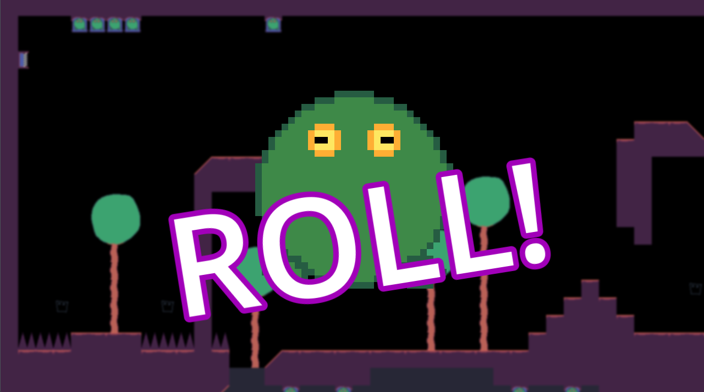
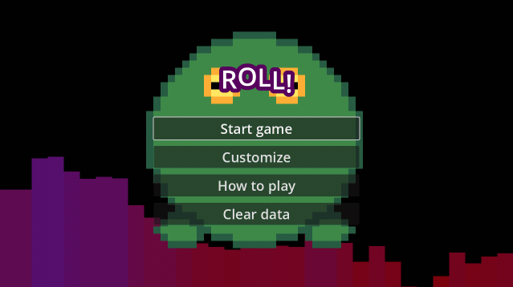

# ROLL! - Ludum Dare 56

|             |                                                                                |
|-------------|--------------------------------------------------------------------------------|
| **Theme**   | _Tiny Creatures_                                                               |
| **Date**    | _October 2024_                                                                 |
| **Type**    | _Compo_                                                                        |
| **Concept** | _Roll and jump in music to save your own kind._                                |

**:rocket: [Play it here!](https://srynetix.github.io/roll/)**

**Controls**:
- Arrow keys to move, jump and aim
- Z to absorb (W for AZERTY)
- X to eject

**Software used**:
- [Godot Engine 4.3](https://godotengine.org/) with my [sxgd-libs](https://github.com/Srynetix/sxgd-libs) plugin collection,
- [Pixel Studio](https://store.steampowered.com/app/1204050/Pixel_Studio__pixel_art_editor/),
- [FL Studio](https://www.image-line.com/fl-studio/)

**Assets used**:
- [gd-plug](https://github.com/imjp94/gd-plug)
- [Font Awesome](https://fontawesome.com/)

_Good luck, and have fun!_

## Preview

